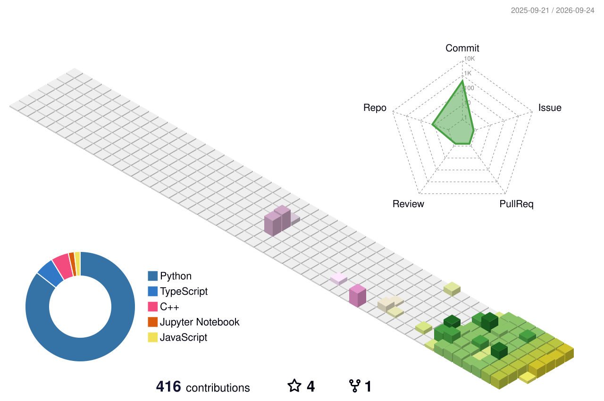

 

 

**I turn codebases into shipped, tested products.** AI Product Engineer who builds AI tools and full-stack apps, automates away repetitive work with GitHub Actions, and documents everything so others can run it.

 

 

## ABOUT ME

> **AI Product Engineer** at Zepiq Labs with hands-on CS background (NASTP Air University, class of '28). I build with **Python, JavaScript/TypeScript, React, FastAPI, Node.js, and cloud deployments (Vercel, Koyeb)**. My focus: delivering **tested, deployed, documented** software — AI systems, full-stack apps, and the automation that keeps them alive.

**Currently building:** [Job-Hunter-AI](https://github.com/aly-abbas11/Job-Hunter-AI) — a fully automated remote-jobs & internships radar that scrapes the web, filters by relevance, and posts results via GitHub Actions every day.

 

## FEATURED WORK

| Project | What it does | Stack |
|---|---|---|
| [**SecureScan AI**](https://github.com/aly-abbas11/SecureScan-AI)   **LIVE** → [securescan-ai.vercel.app](https://securescan-ai.vercel.app) | AI-powered C/C++ vulnerability scanner — CodeBERT + BiLSTM + MLP, **F1: 0.9252** | Python, PyTorch, FastAPI, React |
| [**Job-Hunter-AI**](https://github.com/aly-abbas11/Job-Hunter-AI)   auto-updates daily | Automated remote job radar — scrapes, filters, ranks & posts jobs with a GitHub Action | Python, GitHub Actions |
| [**WritingStyleAI**](https://github.com/aly-abbas11/WritingStyleAI) | Personal AI ghostwriter that learns YOUR voice from your typing — Style DNA + RAG | Python, Groq/Ollama/OpenAI |
| [**Discord Clone**](https://github.com/aly-abbas11/Discord-Clone-Next) | Real-time full-stack chat: servers, channels, Google auth, live messaging | Next.js, Prisma, Clerk, Socket.io |
| [**StudyFlow**](https://github.com/aly-abbas11/StudyFlow-Academic-Momentum) | Academic task manager with streaks and weekly analytics | Node.js, Express |
| [**CodePulse**](https://github.com/aly-abbas11/CodePulse-Collaborative-IDE) | In-browser collaborative IDE with multi-user live code execution | Node.js, Socket.io |

 

## TODAY'S SIGNAL

<!-- TECH_UPDATE_START -->
### Tech update - August 27, 2026

**Nvidia projects $673B in sales as AI demand widens**

Nvidia forecasts 70% fiscal 2028 growth, implying $673 billion in sales as demand expands beyond hyperscalers despite supply constraints.

Read more: https://forgeeks.net/nvidia-673-billion-ai-growth-forecast/
Score: 61 points on Hacker News
<!-- TECH_UPDATE_END -->

 
automated intelligence from Hacker News, resets daily

 

## LATEST TRANSMISSIONS

> Recent thoughts and technical write-ups

<!-- BLOG-POST-LIST:START -->
- [How I Built an AI That Detects C/C++ Security Vulnerabilities &lpar;F1 0.925&rpar;](https://dev.to/alyabbas11/how-i-built-an-ai-that-detects-cc-security-vulnerabilities-f1-0925-4ifp)
- [How to Automate Your GitHub Profile &amp; Build a Live Job Radar with Python](https://dev.to/alyabbas11/how-to-automate-your-github-profile-build-a-live-job-radar-with-python-4g57)
<!-- BLOG-POST-LIST:END -->

 

## AUTOMATION IN ACTION

> This profile updates itself, every day — the same engineering discipline I bring to products.

- **Contribution Snake** — regenerated daily via GitHub Actions
- **3D Activity Map** — rebuilt nightly from commit history
- **Daily Hacker News digest** — the TODAY'S SIGNAL section above
- **Dev.to feed** — the LATEST TRANSMISSIONS section above

<picture>
  <source media="(prefers-color-scheme: dark)" srcset="https://raw.githubusercontent.com/aly-abbas11/aly-abbas11/output/github-contribution-grid-snake-dark.svg" />
  <source media="(prefers-color-scheme: light)" srcset="https://raw.githubusercontent.com/aly-abbas11/aly-abbas11/output/github-contribution-grid-snake.svg" />
  
</picture>

 

## THE NUMBERS

 

## CONNECT

 

