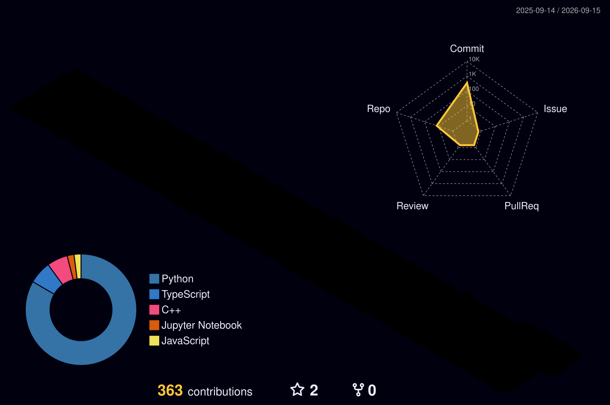

 

## ⚡ TODAY'S SIGNAL

<!-- TECH_UPDATE_START -->
_Loading..._
<!-- TECH_UPDATE_END -->

auto-pulled from Hacker News, resets daily

## 🐍 LIVE ACTIVITY

<picture>
  <source media="(prefers-color-scheme: dark)" srcset="https://raw.githubusercontent.com/aly-abbas11/aly-abbas11/output/github-contribution-grid-snake-dark.svg" />
  <source media="(prefers-color-scheme: light)" srcset="https://raw.githubusercontent.com/aly-abbas11/aly-abbas11/output/github-contribution-grid-snake.svg" />
  
</picture>

## 🧊 3D ACTIVITY MAP

## 🗂️ THE WORK

## 📈 THE NUMBERS

